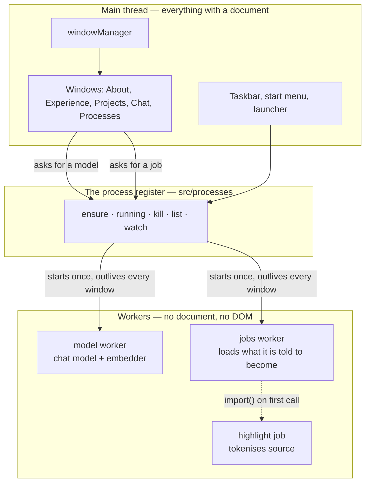

# How this desktop is put together

Notes for somebody reading the repository cold, about the parts that are not
obvious from the code alone — mostly the machinery under the windows rather than
the windows themselves.

- **[Processes](./processes.md)** — what a process is here, why it is not a
  thread, how one outlives the window that started it, and what the Processes
  window is showing you.
- **[Workers](./workers.md)** — the jobs thread, the message protocol, how to
  add a job, and the build constraints that decide whether a worker survives
  being deployed.
- **[What is deliberately not on a worker](./not-on-a-worker.md)** — an
  inventory of every app's logic and the reasoning for leaving nearly all of it
  on the main thread.

## The shape of the thing

A window may start a process and every window may close without it stopping.
That is the whole idea, and the rest of these notes are its consequences.

A window is a `Content` object — a subclass of `OSElement` — handed to
`windowManager.new()`. It owns an element, a stylesheet, and a load/unload
lifecycle. Everything a visitor sees is built that way, and all of it runs on
the main thread, because the DOM only exists there.

Underneath that there are two other ideas, and they are the ones worth writing
down:

**A process** is something running with a lifetime of its own. It is started by
whoever first needs it and stops when it is killed or the tab closes — not when
the window that asked for it goes away. There are two: the model, and the jobs
thread.

**A job** is a piece of app logic that runs on the jobs worker. There is
currently one, and the [inventory](./not-on-a-worker.md) explains why that is
the right number rather than a lack of ambition.

## Two rules worth knowing before changing anything

**Ask the document, not a field.** Components used to record their own mounting
in a `parent` pointer, and anything that removed an element without going
through `unload()` left that record wrong and the component unshowable for the
rest of the session. `OSElement.mounted` reads `isConnected` instead. The same
mistake in the start menu made a press meant to open it read as a press to
close.

**A filled animation outranks an inline style.** An exit that fills forwards
goes on applying its last keyframe, and no amount of `element.style.opacity = ""`
will undo it — animations sit above normal inline declarations in the cascade.
Cancel the animation, and do it while the element is still in the document,
because `getAnimations()` on a detached element reports nothing to cancel.

Both of these shipped, twice, in different disguises. They are written up where
they happened as well as here.
