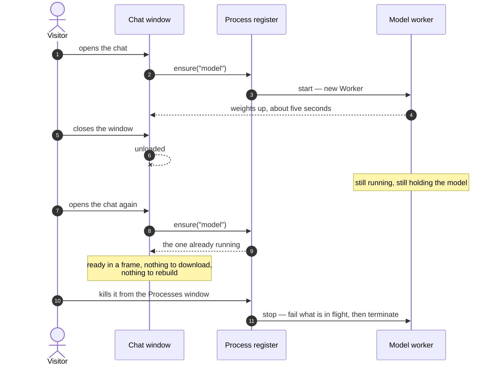
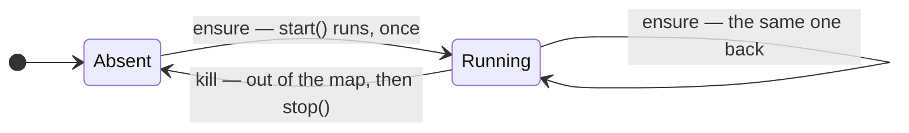

# Processes

`src/processes/index.ts`

## What a process is here

Something running with a lifetime of its own. A window may start one; every
window may close without it stopping. It ends when it is killed, or when the tab
does.



That is the whole idea, and it exists because of one concrete failure. Opening
the chat window brings up half a gigabyte of weights. Closing the window and
opening it again used to rebuild them — not re-download, the browser had the
files, but read back and compiled into a graph, which is seconds of arithmetic
to arrive at exactly the state that had just been thrown away. The window's
lifetime was the wrong lifetime for the model.

## What it is not

It is not a thread, and it is deliberately not named after one.

A process here is a named thing that is running, an entry in a table, and
something that can be stopped. Whether the work happens on the main thread or on
a worker is the service's own business, and nothing above the register can tell
— which is what makes moving something onto a worker a change to one `start`
function rather than a change to everything that asks for it.

**There is no fork, and there will not be one.** A worker has no shared address
space and no copy-on-write; `postMessage` copies by serialising. The part of the
Unix model that does not survive the trip to a browser is exactly the part that
makes forking worth doing. What survives is the bookkeeping: names, lifetimes, a
table you can read, and a way to kill something.

The closest thing available is spawn-then-exec, and that is what the jobs worker
does — see [workers](./workers.md).

## The register




```ts
import * as processes from "../processes"

const thing = () => processes.ensure<Worker>({
  name: "thing",                    // identity: asking twice gets the first one
  label: "Thing",                   // what the table calls it
  detail: () => state?.description, // one live line, read at draw time
  start: () => new Worker(new URL("./thing.worker.ts", import.meta.url), { type: "module" }),
  stop: (worker) => { state = undefined; worker.terminate() },
})
```

| | |
|---|---|
| `ensure(service)` | the running thing under this name, started if it is not already |
| `running(name)` | whether it is up. Starts nothing |
| `kill(name)` | stop it and release what it held |
| `list()` | everything running, oldest first |
| `watch(fn)` | be told when the table changes; returns its own unsubscribe |
| `reset()` | kill everything — for tests |

Four things about it that are load-bearing:

**`start` is lazy and runs once.** Keep the call sites lazy too, so a visitor who
never opens the surface that needs a service never starts one.

**`stop` must invalidate every handle derived from the resource**, not just
release the resource. A chat engine whose `load()` already resolved will happily
report a ready model on a thread that no longer exists.

**`stop` must also fail whatever is in flight.** `worker.terminate()` fires no
event, so killing a process would otherwise leave every outstanding call
unsettled — which is indistinguishable from something being very slow. That
failure has shipped here before, from the other direction, and the comments in
`src/ai/index.ts` and `src/processes/jobs.ts` say so at the places that prevent
it.

**`kill` removes the entry before calling `stop`,** so a teardown that reaches
back into the desktop finds itself already gone rather than halfway out. The
redraw runs in a `finally`, so a `stop` that throws still updates the table.

## `detail()` is called about once a second

The Processes window redraws on every change *and* on a 1s interval, so `detail`
must be synchronous, cheap, and honest. Return `undefined`, or say "loading",
rather than guessing — the model service reports `"SmolLM2 135M · loading"`
until it actually knows which device it got, because claiming one before the
load settles would be inventing an answer.

## What is in the table

| Process | Started by | Holds |
|---|---|---|
| `model` | opening the chat window, or the launcher's semantic search | the chat model and the embedder, on one worker |
| `jobs` | the first call to any job | the jobs worker and whichever job modules have been loaded |
| `attention` | the desktop, once it has finished starting up | what the visitor has done — window events, in memory, this tab only |

The first two are on workers; `attention` runs on the main thread, and the
register does not care either way. That is the point of it not being called a
thread.

`attention` is a process for a reason that is not tidiness. It notices what
somebody is doing so the desktop can occasionally offer something, and anything
that watches a person should be visible to them and stoppable by them: it is in
the table, it says what it has seen, and the kill button ends it and forgets.
It never starts a model — it asks whether one is already up, and takes no for an
answer.

## Killing something

The Processes window offers it with no confirmation, on purpose: nothing here
holds anything a person typed, and the cost of being wrong is one reload. What
it does mean is that the next window wanting that service pays the load again —
which the window says out loud rather than leaving to be discovered.

## Testing

jsdom has no `Worker`. Stub one, reply on a microtask so nothing can depend on
an answer arriving inside the call that sent it, and call `processes.reset()` in
`afterEach`. `test/processes.test.ts`, `test/aiProcess.test.ts` and
`test/jobs.test.ts` are the worked examples.
